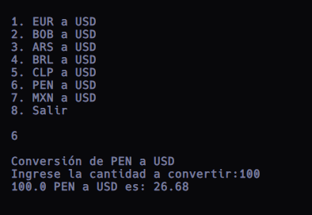
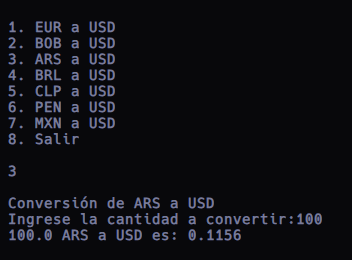
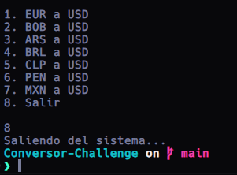

# Conversor de Monedas Challenge

Este proyecto es un conversor de monedas desarrollado en Java utilizando la API de ExchangeRate-API. Permite a los usuarios convertir entre diferentes monedas y obtener tasas de cambio actualizadas.

## Características

- **Menú intuitivo:** El conversor presenta un menú fácil de usar con opciones claras para seleccionar las operaciones deseadas.
- **Conversión en tiempo real:** Utiliza la API de ExchangeRate-API para obtener tasas de cambio actualizadas y realizar conversiones precisas.
- **Interfaz gráfica:** Las capturas de pantalla muestran cómo se ve el menú del conversor de monedas.

## Imágenes  

### Menú Principal

## Instrucciones de Uso

1. Clona este repositorio en tu máquina local.
2. Abre el proyecto en tu IDE de Java preferido (como Eclipse o IntelliJ IDEA) o un editor de código como Visual Studio Code.
3. Ejecuta la aplicación y sigue las instrucciones en pantalla para realizar conversiones de monedas.
